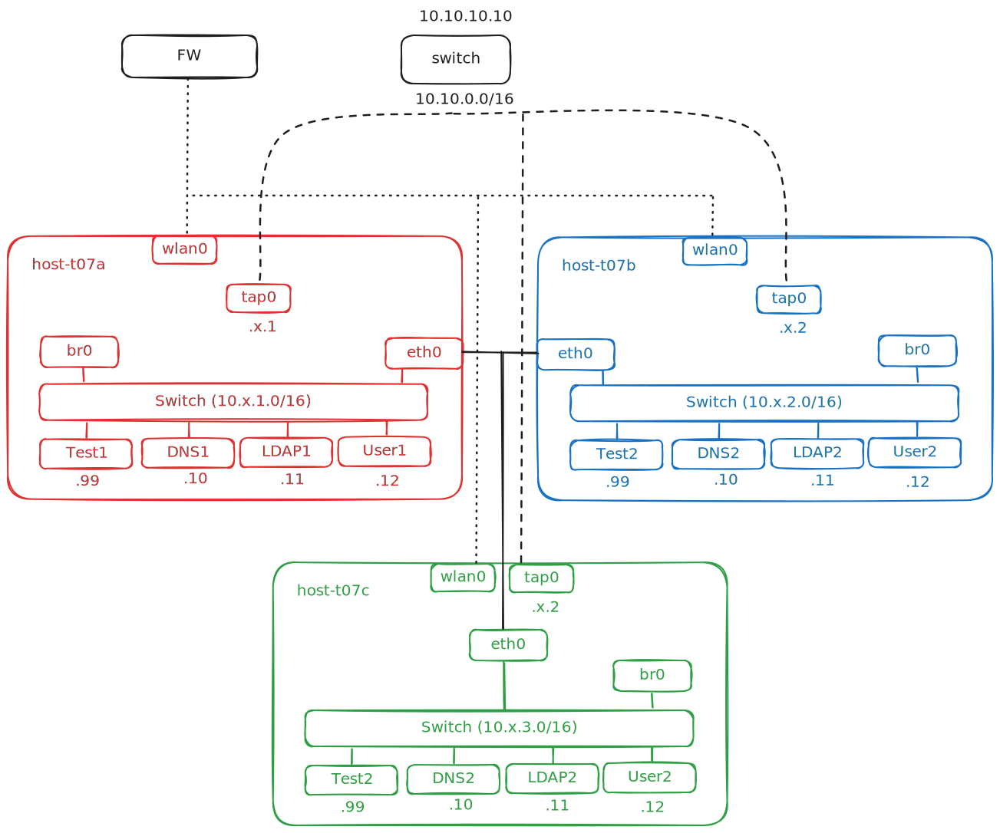

## Inhalt
1. [Base Setup](doc/1_Base_Setup.md)
2. [SSH Keys](doc/2_SSH_Keys.md)
3. [Network](doc/3_Network.md)
	1. [br0](network/br0.md)
	2. [tap0](network/tap0.md)
4. [SSH Connection Test](4_SSH_Connection_Test.md)
5. [NOS VPN Service](5_NOS_VPN_Service.md)
6. [RIP Setup](doc/6_RIP_Setup.md)
7. [LXC_Setup](7_LXC_Setup.md)
	1. [lxc-debian+.patch](doc/lxc-files/lxc-debian+.patch)
	2. [lxc-debian+.patch.sha256](doc/lxc-files/lxc-debian+.patch.sha256)
	3. [nos-net](doc/lxc-files/nos-net)
	4. [nos.nft](doc/lxc-files/nos.nft)
8. [NOS_Setup](8_NOS_Setup)
	

